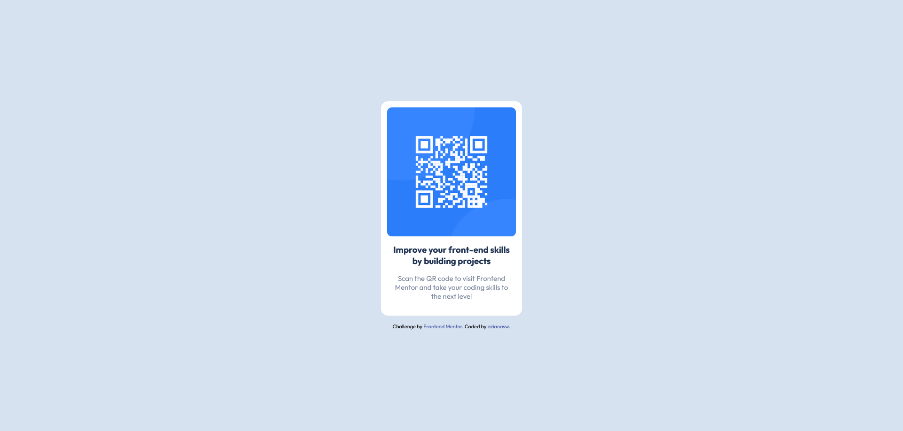

# Frontend Mentor - QR code component solution

This is a solution to the [QR code component challenge on Frontend Mentor](https://www.frontendmentor.io/challenges/qr-code-component-iux_sIO_H). Frontend Mentor challenges help you improve your coding skills by building realistic projects. 

## Table of contents

- [Overview](#overview)
  - [Screenshot](#screenshot)
  - [Links](#links)
- [My process](#my-process)
  - [Built with](#built-with)
  - [What I learned](#what-i-learned)
  - [Continued development](#continued-development)
  - [Useful resources](#useful-resources)
- [Author](#author)

## Overview

### Screenshot




### Links

- Solution URL: [https://github.com/azianasw/qr-code-component-main](https://github.com/azianasw/qr-code-component-main)
- Live Site URL: [https://azianasw.github.io/qr-code-component-main/](https://azianasw.github.io/qr-code-component-main/)

## My process

### Built with

- Semantic HTML5 markup
- CSS variable
- Flexbox
- Mobile-first workflow

### What I learned

Build a card component using Semantic HTML5 markup, see below:

```html
<article class="card">
  
  <h3 class="card-title">Improve your front-end skills by building projects</h3>
  <p class="card-description">Scan the QR code to visit Frontend Mentor and take your coding skills to the next
    level</p>
</article>
```

Make use of CSS Flexbox to arrange items horizontal or vertical and use CSS variable to define color palette, see below:

```css
:root {
  --color-white: hsl(0, 0%, 100%);
  --color-light-grey: hsl(212, 45%, 89%);
  --color-grayish-blue: hsl(220, 15%, 55%);
  --color-dark-blue: hsl(218, 44%, 22%);
}
.container-center {
  display: flex;
  flex-direction: column;
  justify-content: center;
  align-items: center;
  gap: 1rem;
  height: 100vh;
  background-color: var(--color-light-grey);
  padding: 0 1.5rem;
}
```

### Continued development

- CSS Preprocessors?
- Practice more about Layout using CSS utils (Flexbox, CSS Grid)

### Useful resources

- [Flexbox](https://css-tricks.com/snippets/css/a-guide-to-flexbox/) - This helped me for understanding flexbox.
- [Semantic HTML5 markup](https://www.w3schools.com/html/html5_semantic_elements.asp) - All about Semantic HTML5 markup.

## Author

- Website - [Azian](https://azianasw.github.io/)
- Frontend Mentor - [@azianasw](https://www.frontendmentor.io/profile/azianasw)
